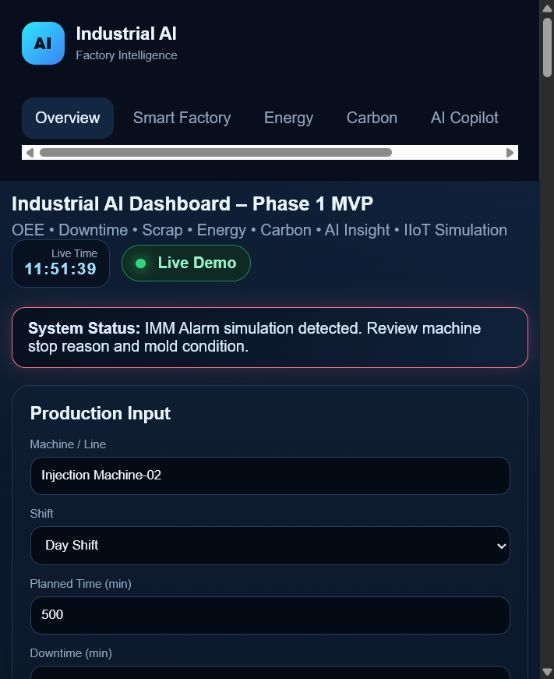

# Industrial AI Dashboard

## Project Overview

Industrial AI Dashboard is a prototype dashboard for factory performance and sustainability monitoring.

It demonstrates how factory managers can view OEE, downtime, scrap, energy use, and carbon emissions in one simple dashboard. The project is part of FutureGreen by Sorawit's digital tool portfolio for Thai SME factories.

TH: ระบบนี้เป็นตัวอย่าง Dashboard โรงงาน เพื่อให้ผู้บริหารและทีมหน้างานเห็นภาพรวมของการผลิต พลังงาน และคาร์บอนได้ง่ายขึ้น

## Business Problem

Many factories collect production, quality, maintenance, energy, and carbon-related data separately. This makes it difficult for managers to see the real situation quickly, compare losses, and prioritize improvement actions.

Without a simple dashboard, decision-making often depends on delayed reports, spreadsheets, or manual summaries.

## Objective

- Demonstrate a practical factory dashboard concept.
- Show how OEE, downtime, scrap, energy, and carbon data can be connected.
- Support management review, improvement planning, and smart factory discussions.
- Provide a visual prototype for consulting conversations before building a client-specific system.

## Target Users

- Factory owners and executives
- Plant managers
- Production managers
- Maintenance and utility teams
- Quality and continuous-improvement teams
- ESG / energy / sustainability officers
- Consultants demonstrating smart factory concepts

## Key Features

- OEE KPI cards
- Downtime and scrap overview
- Energy dashboard
- Carbon dashboard
- Factory performance snapshot
- AI insight / copilot concept
- Industrial dark dashboard UI
- Responsive layout for demo use

## Tech Stack

- HTML
- CSS
- JavaScript
- Chart.js
- LocalStorage
- GitHub Pages

## Use Case for Consulting Work

This prototype can be used in consulting discussions to show what a factory dashboard could look like before a full implementation.

Example consulting use cases:

- Smart factory roadmap workshops
- OEE and loss-analysis discussions
- Energy and carbon visibility planning
- Management review dashboard design
- Factory data-readiness assessment

## Project Status

Prototype / MVP

The project is suitable for demonstration and portfolio use. It is not production-ready because it does not include authentication, a production database, user roles, access control, backup, monitoring, or integration with real factory systems.

## Demo Link

Live Demo: https://thesor55.github.io/industrial-ai-dashboard/

## Screenshots

## Future Improvement Plan

- Add clearer sample data sources and assumptions.
- Add more dashboard pages for OEE, energy, carbon, and quality.
- Add exportable management summary.
- Add optional API/database connection for real implementation.
- Add authentication and role-based access before production use.

## Disclaimer

This project is a prototype for demonstration and consulting discussion. All displayed data should be treated as simulated or sample data unless configured for a real client implementation.

## Recommended GitHub About Description

Factory dashboard demo that helps managers see OEE, downtime, scrap, energy use, and carbon emissions in one simple view.

## Recommended GitHub Topics

`iso` `esg` `carbon-footprint` `cfo` `cfp` `factory-dashboard` `audit-checklist` `sustainability` `smart-factory` `thai-sme` `github-pages`
